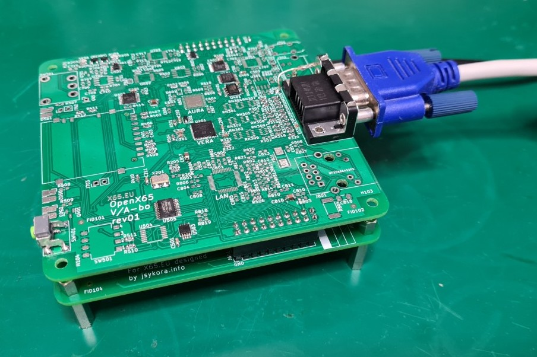
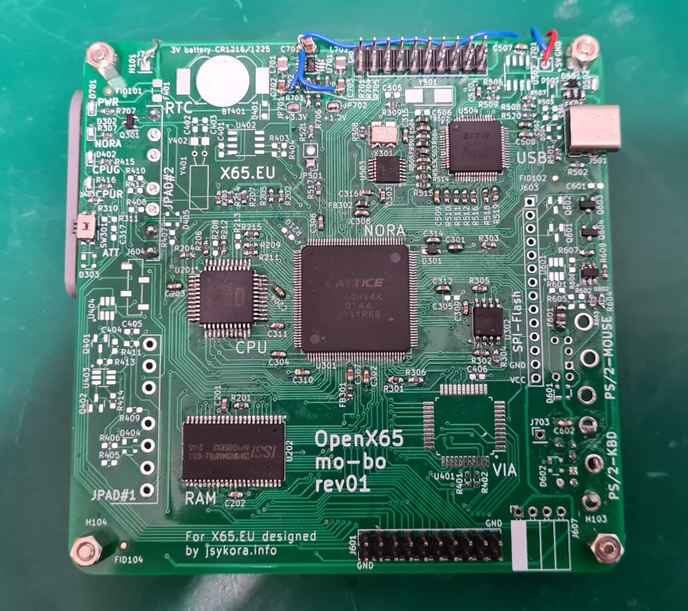
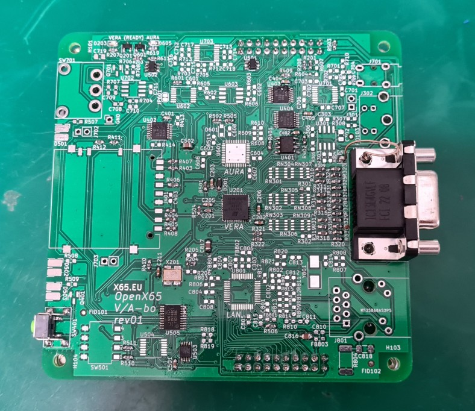

Open-X65
=========

The 65c02 and 65c816-based modern computer with a retro feel.

----------------------------------------------------------------------------

*STOP* *STOP* *STOP* *STOP* *STOP* *STOP* *STOP* *STOP* *STOP* *STOP* *STOP* 

Stop, read and think:

THIS HARDWARE PROJECT IS A WORK-IN-PROGRESS AND NOT "RELEASED"!

Some parts are untested yet, and some parts may even contain *known* bugs 
THAT ARE INTENTIONALLY NOT FIXED IN THE SCHEMATIC OR THE PCB LAYOUT!
(Explanation: as soon a schematic+layout revision gets produced in a fab,
the document must never change. Changes are allowed only in new revisions!)

... YOU HAVE BEEN WARNED ...

*STOP* *STOP* *STOP* *STOP* *STOP* *STOP* *STOP* *STOP* *STOP* *STOP* *STOP* 

----------------------------------------------------------------------------

Features:
----------

* The CPU is W65C02 (8-bit) or the W65C816 (16-bit). The motherboard PCB supports both options (but W65C816 has not been tested so far).
* Backward software compatibility with the [Commander X16](https://www.commanderx16.com/) computer.
* Use only components that are in production and readily available from normal distributors such as Mouser, Farnell, Digikey etc.
* Of course, no cheating by using a hidden powerful ARM processor that does heavy lifting in the background ;-)
  The design shall be balanced and consistent in the components it uses.
* Free and open-source design.
* DIY and hobby-builders friendly.
* Low-cost to build in small quantities by individual hackers.

The current architecture:
--------------------------
* A two-PCB stacked construction: Motherboard (mo-bo) at the bottom and Video-Audio board (va-bo) at the top,
  connected by two 20-pin headers. Each board is exactly 100x100mm and just 2-layers. 
  This construction has following advantages:
  * the PCB stack can be placed inside Eurocard housings
  * 100x100mm / 2-layers is cheaply manufactured by many PCB vendors in small quantities

In detail, the motherboard PCB has (*mo-bo* rev01):
* CPU: W65C02 (or W65C816) in the QFP-44 package.
* Memory: 2MB asynchronous SRAM.
* NORA FPGA: Lattice FPGA iCE40HX4K (TQFP-144) to handle address decoding, glue logic, PS/2 interfaces. 
  ("NORA" stands for NORth Adapter, because it is very similar as traditional north bridge in a PC/X86 architecture.)
* Two ports for SNES-style controllers, connected to a virtual VIA in the NORA FPGA.
* Two PS/2 ports for keyboard and mouse, handled by NORA.
* RTC chip with battery backup.
* Fully integrated programmer and debugger with the FTDI USB 2.0 / UART+SPI chip, and a host software in Python
  that runs on Linux and Windows PCs. The host SW can directly program all flash memories on the board (currently only from Linux),
  load software and data into SRAM, peek and poke I/O registers, and reset/step/run the CPU.
  It does not allow directly accessing the CPU registers, because JTAG simply did no exist
  in the 1970's when the CPU was designed :-)
* Power input: no-fuss 5V input from a standard USB Type-C device port.
  The entire computer can be powered from a host-PC USB port, or standalone from a common USB charger with 5V output.

The video-audio PCB has (*va-bo* rev01):
* VERA FPGA: the Video Embedded Retro Adapter implemented in Lattice iCE40UP5K. The same is used in Commander X16.
* VGA and S-Video video output ports, optional composite (requires a passive adapter on S-Video).
* SD-card slot handled by VERA FPGA.
* AURA FPGA (optional): the Audio Retro Adapter implemented in Lattice ICE5LP2K-SG48 will provide FM synthesizer sound
  on top of the PCM/PSG sound generated in VERA. AURA shall be software-compatible with Yamaha YM2151 (most likely through the jt51 project).
* Stereo sound output through a 3.5mm jack.
* Built-in mono speaker (with a mechanical switch to switch it off), in case the user does not want to bother with external speakers.
* RJ45 LAN 10/100Mbps Ethernet port realized by Wiznet W6100, with hardware-integrated TCP/IP v4/v6 stack.

Photos:
--------

Overview photos (2023-05-08):

Running Commander X16 ROM and BASIC program (compatibility testing only, not allowed in production use due to a proprietary license):

Structure of the GIT repository:
---------------------------------

* `fpga-nora' --> verilog code for the NORA FPGA on the motherboard.
* `fpga-vera' --> VERA FPGA bitstream (100% derived from https://github.com/fvdhoef/vera-module)
* `pcb' --> hardware projects in Kicad:
  - `mobo-rev01' --> Motherboard rev01
  - `vabo-rev01' --> Video/Audio board rev01
* `x65prog' --> linux software to program the on-board SPI flash memories from a host Linux PC via the USB link.
* `x65pyhost' --> python scripts for accessing/debugging the X65 from a host PC via the USB link.

Schematics in PDF:
------------------

[Motherboard, rev01](pcb/mobo-rev01/scm-print/openX65-mobo-rev01-schematic.pdf)
[Video/Audio board, rev01](pcb/vabo-rev01/scm-prints/openX65-vabo-rev01-schematic.pdf)

Software:
-----------

Whenever a new computer hardware is designed, there is always the egg-and-chicken question from where software should come from. 
The Open-X65 is designed to be software backwards-compatible with the Commander X16 retro-modern computer.
It means, if implementation proceeds as planned, the Open-X65 could run unmodified X16 ROM and all programs.
(Excluding programs depending on strange hardware that we don't support: cartridges, Commodore IEC port.)
That being said, the problem is that the [X16 ROMs](https://github.com/commanderx16/x16-rom) including KERNAL and BASIC 
are proprietary and licensed only for use with the original Commander X16 hardware (and emulators, apparently).
Therefore, the ROMs shall not be loaded into the Open-X65 HW in production use (i.e. having any kind of fun, apparently).
We use them just for compatibility testing with X16 and we make sure there is (almost) no fun going on while the ROM is loaded :-o

Long term, there are multiple good options, for example:
* port of the [MEGA65 OPEN-ROMs](https://github.com/MEGA65/open-roms), which are true free open-source,
* port of the [FastBasic](https://github.com/dmsc/fastbasic)
* port of the [GeckOS](http://www.6502.org/users/andre/osa/index.html)
* ...

Compared to the 8-bit 65C02 CPU, the 16-bit 65C816 CPU offers a linear 24-bit address space, so a bigger OS with GUI should be
more easily possible. At minimum, something like the GEOS. (PC/GEOS is a free software, but it is for X86).
