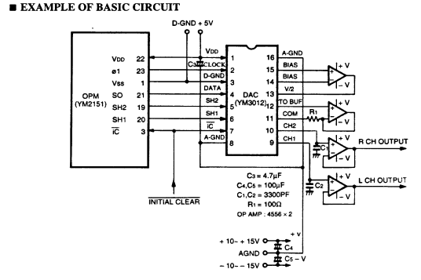

AURA FPGA: The replacement of YM2151 and YM3012
===============================================

Sound in Commander X16
-----------------------

Sound in Commander X16 is generated by two independent sources:

    a) by the Programmable Sound Generator (PSG) in VERA FPGA, and
    b) by the MIDI FM-synthesis chip YM2151. 

The following picture is a block diagram of the sound subsystem in C'X16:

The PSG is a stereo sound generator loosely based on SID. It supports 16 channels (voices) and PCM playback.
There is no ADSR or filters. This must be provided by software.
The PSG is an integral part of VERA FPGA user logic.

MIDI-like sound synthesis is provided by YM2151. Yamaha called it an FM operator Type-M (OPM).
The chip outputs sound digitally as 10-bit mantissa / 3-bit exponent samples, two channels (left and right),
audio sample frequency about 55 kHz. This digital stream is converted to an analog signal using special D/A converter YM3012.
The picture below illustrates the basic circuit, as taken from the datasheet:

YM2151 was created by Yamaha in 1980's, being used by Atari and Sega arcade systems starting in 1984.
As of 2023, this chip is maybe a quarter of century out of production.
The chip interfaces with then-standard 5V TTL logic, and the D/A converter YM3012 even requires +/- 12V rails for its analog output.

Sound in x65
------------

I was looking for a modern compatible replacement of these chips and, since the architecture is unique (there were no second sources on the market), 
the only practical solution is via an emulation in FPGA. I wanted to use a Lattice iCE40 FPGA, to keep in line with the rest
of my x65 design (both NORA and VERA are iCE40 FPGAs). 
There are multiple YM2151 emulations for FPGA available on the open-source internet; I found two: jt51 and IKAOPM.
The problem with both, or rather the problem with the original design is that it is using a lot of flip-flops as delay shift-registers.
This is actually not a big deal for modern FPGAs from Altera/Intel or Xilinx/AMD, as they could implement shift-registers efficiently in LUTs.
But an old architecture like iCE40 struggles and is forced to use a lot of basic logic blocks to implement these shift registers.
Therefore, jt51 could not be used because it does not fit in a suitable FPGA.
The IKAOPM, after some configuration (USE_DPRAM=1), thankfully fits in the 5K device (ice40up5k-sg48) - allocating around 80% capacity of the 5K device.

The FPGA device implementing the compatible FM-synthesis is called "AURA". 
It is Lattice ice40up5k-sg48 FPGA, the same type used for VERA, so the x65 has twice the same FPGA on the board - for audio and for video.
The emulation main part is done by IKAOPM project, which is a verilog synthesisable replica of the YM2151.

The picture below shows the sound subsystem of x65:

AURA outputs the sound in the stereo 16-bit I2S format, which is converted to the analog signal by the WM8524 D/A converter.
The PSG sound from VERA is also in the same I2S format. AURA has an auxiliary I2S input for the PSG sound; mixing of both sound sources
is done digitally in AURA.

Cost Comparison and the Conclusion
----------------------------------

Since both Yamaha chips are long out of production, it is not possible to buy them from normal distributors of electronic parts 
like Mouser, Farnell, Digikey etc. The parts are typically to be had on ebay from various sellers, in various quantities and prices.
Ideally one gets an old new stock part, or in a bad case a sub-par clone.
A brief ebay listings overview shows that the D/A YM3012 costs around 1 EUR/1pc, and the FM-synth YM2151 around 9 EUR/1pc. 
So the total cost with original new-old Yamaha parts could be 10 EUR, plus the analog sound mixer.

The ice40up5k-sg48 FPGA costs around 9.30 EUR/1pc, or 7.8 EUR in 100-piece quantity. To this we should add the cost of one SPI-Flash
memory necessary to store the FPGA bitstream; I use W25Q16JVSNIQ which costs 0.45 EUR/1pc. 
I do not add the cost of the D/A converter WM8524 since it is also present in the C'X16 solution for the VERA PSG output conversion.
Therefore, the total cost using AURA FPGA is also around 10 EUR in 1pc quantity (or better, if bought in quantity).

In conclusion, the solution with AURA FPGA has the following advantages:

* better availbility of parts, 
* same or better cost, 
* direct interfacing with the 3.3V LVTTL logic of x65 design, 
* not requiring +/- 12V for the DAC, 
* and the smaller total footpring size on the PCB because of modern component packages.
