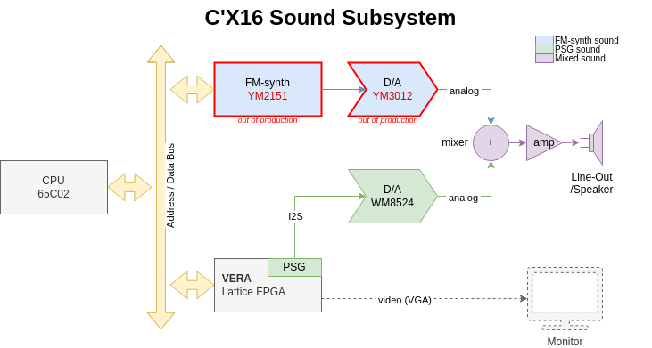
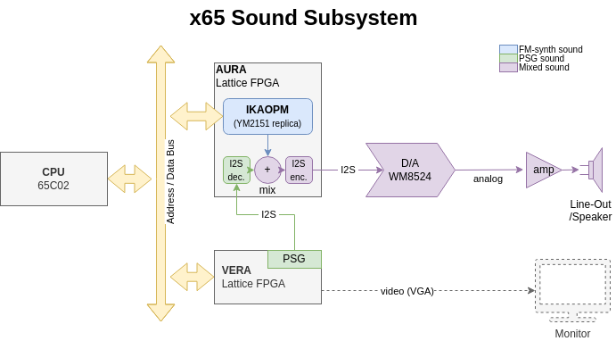
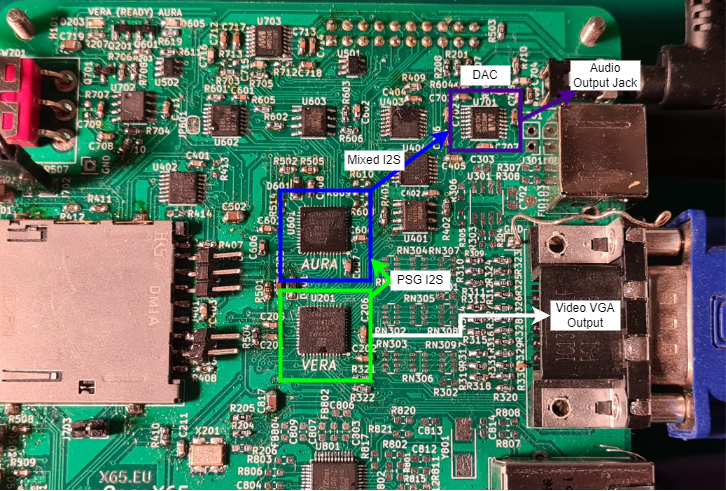
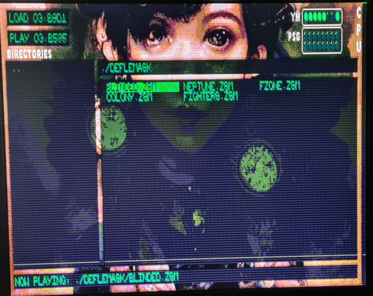

AURA FPGA: The replacement of YM2151
====================================

*Abstract:
The article discusses the sound system in the X65 computer. It explains that the sound is generated by two sources: 
the Programmable Sound Generator (PSG) in the VERA FPGA and the MIDI FM-synthesis chip YM2151. 
The article provides a block diagram of the sound subsystem and explains the functionality of each component. 
It also discusses the principle of FM sound synthesis and mentions the difficulty in finding modern software compatible 
replacements for the YM2151 and YM3012 chips. The article introduces an FPGA emulation solution called AURA, 
which uses the Lattice iCE40 FPGA to replicate the YM2151. The implementation of AURA on the x65 board is described, 
along with a cost comparison between the Yamaha chips and the AURA FPGA. 
The article concludes by mentioning a demo application called Calliope that runs on the x65 hardware 
and plays sound files through AURA. 
Overall, the AURA FPGA solution is presented as a viable and cost-effective alternative to the original Yamaha chips.*

Sound in Commander X16
-----------------------

Sound in Commander X16 is generated by two sources that are mixed together:

  1) by the Programmable Sound Generator (PSG) in VERA FPGA, and
  2) by the MIDI FM-synthesis chip YM2151. 

The following picture is a block diagram of the sound subsystem in C'X16:

The PSG in VERA FPGA is a stereo sound generator loosely based on SID. It supports 16 channels (voices) and PCM playback.
There is no ADSR or filters. This must be provided by software.
The PSG is an integral part of VERA FPGA user logic that also generates the VGA video output.

MIDI-like sound synthesis is provided by YM2151. Yamaha called it an FM operator Type-M (OPM).
The chip outputs sound digitally as a 10-bit mantissa / 3-bit exponent samples, two channels (left and right),
at the audio sample frequency of about 55 kHz. This digital sound stream is converted to an analog signal 
using special a D/A converter YM3012, also developed by Yamaha.
The picture below illustrates the basic circuit, as taken from the datasheet:

YM2151 was created by Yamaha in 1980's, being used by Atari and Sega arcade systems starting in 1984.
As of 2023, this chip is perhaps a quarter of century out of production.
The chip interfaces with then-standard 5V TTL logic, and the D/A converter YM3012 even requires +/- 12V rails for its analog output.

Principle of FM Sound Synthesis
-------------------------------

FM sound synthesis is quite complex topic and I do not claim to understand it so well.
I would recommend the following article which provides some background and details:

https://www.perfectcircuit.com/signal/what-is-fm-synthesis

Sound in x65
------------

I was looking for a modern software compatible replacement of these chips and, since the architecture is unique, 
the only practical solution is via an emulation in FPGA. I wanted to use a Lattice iCE40 FPGA, to keep in line with the rest
of my x65 design (both NORA and VERA are iCE40 FPGAs). 
There are multiple YM2151 emulations for FPGA available on the open-source internet; I found two: jt51 and [IKAOPM](https://github.com/ika-musume/IKAOPM).
The problem with both, or rather the problem with the original design is that it is using a lot of flip-flops as delay shift-registers.
This is actually not a big deal for modern FPGAs from Altera/Intel or Xilinx/AMD, as they could implement shift-registers efficiently in LUTs.
But an old architecture like iCE40 struggles and is forced to use a lot of basic logic blocks to implement these shift registers.
Therefore, jt51 could not be used because it does not fit in a suitable FPGA of the iCE40 line.
The IKAOPM, after some configuration (USE_DPRAM=1), thankfully fits in the 5K device (ice40up5k-sg48) - allocating around 80% capacity of the 5K device.

I call the FPGA device implementing the compatible FM-synthesis "AURA", from AUdio Retro Adapter.
It is Lattice ice40up5k-sg48 FPGA, the same type used for VERA, so the x65 has twice the same FPGA on the board - for audio and for video.
The emulation main part is done by IKAOPM project, which is a verilog synthesisable replica of the YM2151.

The picture below shows the sound subsystem of x65:

AURA outputs the sound in the stereo 16-bit I2S format, which is converted to the analog signal by the WM8524 D/A converter.
The PSG sound from VERA is also in the same I2S format. AURA has an auxiliary I2S input for the PSG sound; mixing of both sound sources
is done digitally in AURA.

Implementation on the x65 Board
-------------------------------

The photo bellow shows the x65 audio/video board with the VERA and AURA FPGAs labelled. The DAC chip and the audio and video output connectors
are also visible and marked.

TBD: record sound played through VERA + AURA.

Cost Comparison
---------------

Both Yamaha chips are long out of production (discontinued). 
It is not possible to buy them from normal distributors of electronic parts  like Mouser, Farnell, Digikey etc. 
The Yamaha chips are typically to be had on ebay from various sellers, in various quantities and prices.
A brief ebay listings overview shows that the D/A YM3012 costs around 1 EUR/1pc, and the FM-synth YM2151 around 9 EUR/1pc. 
Therefore the total cost using Yamaha parts could be 10 EUR, plus the analog sound mixer.

The AURA FPGA, ice40up5k-sg48, costs around 9.30 EUR/1pc, or 7.8 EUR in 100-piece quantity. 
To this we should add the cost of one SPI-Flash memory necessary to store the FPGA bitstream; 
I use W25Q16JVSNIQ which costs 0.45 EUR/1pc. 
I do not calculate the cost of the D/A converter WM8524 since it is equally present in both solution (for VERA PSG).
Therefore, the total cost using AURA FPGA is around 10 EUR in 1pc quantity (or better, if bought in quantity).

Demo
----

[Calliope](https://github.com/ZeroByteOrg/calliope) is a player / jukebox application for Commander X16.
It can play files in the ZSM format. It supports output through the VERA PSG and YM2151 FM-synth.
This is a photo od Calliope running on X65 hardware, playing a sound file through the AURA:

Conclusion
----------

In conclusion, the solution with AURA FPGA has the following advantages:

* good availbility of chips at distributors, 
* the same or better cost, 
* direct interfacing with the 3.3V LVTTL logic used in the x65 design, 
* not requiring +/- 12V for the DAC, 
* smaller total footpring size on the PCB because of small component packages.
