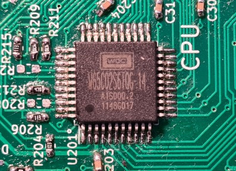
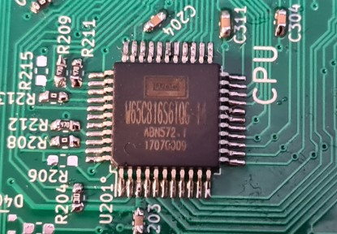
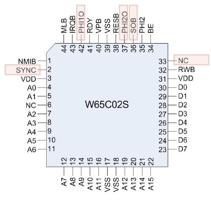
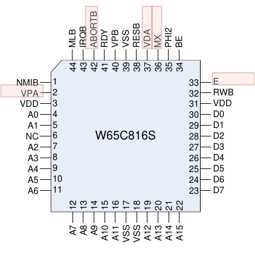
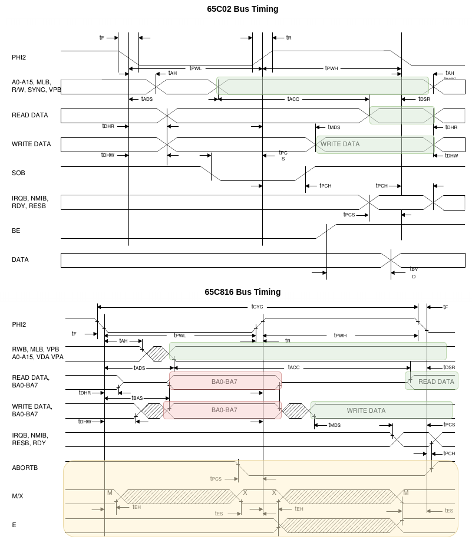

Differences between the 65C02 and 65C816 Processors in 8-bit Mode
====================================================================

In X65 the assembled CPU is either the 8-bit W65C02S or 16-bit W65C816S. 
The W65C816S is (partially) compatible with W65C02S. 
This page summarizes the differences from the low-level hardware point of view and in the case that the 65C816
is running in the 8-bit *Emulation Mode*.

These two photos shows the processors assembled on X65 main board:

Processor Pinout Comparison
----------------------------

Both processors are available in the same QFP-44 package, so they could be assembled alternatively on the same PCB.

The drawing below shows processor pin functions side by side.
I marked pins with differing function in red colour:

The following table compares those pins.
In case of 65C02, most of these pins (except of SYNC) can be just ignored since their function is not important.
In case of 65C816 the pins provide additional status information from the processor (E, MX, VPA, VDA),
or new features (ABORTB).

| Pin | 65C02            | 65C816 | Difference                                              |
|-----|------------------|--------|---------------------------------------------------------|
| 2   | SYNC             | VPA    | See below.                                              |
| 33  | NC (no connect)  | E      | 816: Status of the E-flag (emulation mode).             |
| 36  | SOB (Set Overf.) | MX     | 02: Ignore (pull-up). 816: Status of M and X flags.     |
| 37  | PHI2O            | VDA    | 02: Ignore. 816: see below.                             |
| 42  | PHI1O            | ABORTB | 02: Ignore. 816: Instruction abort input (MMU support). |

The SYNC pin in 65C02 provides an important feature for instruction tracing: it goes high when 
the first instruction byte is being fetched by the CPU. By observing SYNC it is possible to single-step
the CPU or reconstruct the instruction stream.

In case of 65C816, instead of SYNC two other signals are provided: VPA (Valid Program Address)
and VDA (Valid Data Address). All four combinations of VPA and VDA provide useful processor status:

| VDA | VPA | State (65C816)                                                                                  |
|-----|-----|-------------------------------------------------------------------------------------------------|
| 0   | 0   | Internal Operation Address and Data Bus available. The Address Bus may be invalid.              |
| 0   | 1   | Valid program address-may be used for program cache control.                                    |
| 1   | 0   | Valid data address-may be used for data cache control.                                          |
| 1   | 1   | Opcode fetch-may be used for program cache control and single step control. == SYNC in 65C02 !! |

The SYNC signal of 65C02 is equivalent to (VPA==1 && VDA==1) in 65C816.

Bus Signal Timing Comparison
-----------------------------

Below I put the bus timing pictures of 65C02 and 65C816 next to each other.
I colour-marked the differences between the processors: 
* **green** marks the identical timing of read and write data: they are valid at the falling edge of PHI2.
* **red** marks the new feature of Bank Address, which is available on Data Bus at the rising edge of PHI2.
    This was not present in 65C02.
* **yellow** marks new signals in 65C816, not available previously.

Observations:

* Data Bus is always actively driven by 65C816 in the first half-cycle (PHI2 low) to provide the Bank Address to the outside world,
    even if the current cycle is a Read (RWB=1). Therefore, external circuits must never drive the Data Bus
    when PHI2=low. The RWB applies just to the second phase (PHI2=high).
* New signals VPA and VDA indicate a valid address. In case both are zero, then the memory address provided by the CPU is potentially
    invalid ==> the external circuit must not decode & respond to that address.

Instruction Cycle Timing Comparison
-------------------------------------

Looking at cycle-by-cycle traces of one example instruction 'ROL $a823' we can spot some minor differences.
This instruction is supposed to read a value at memory address $a823, rotate left by 1 bit, and write the result
back to the same memory location.

**65C02:**

    Step #   1:  MAH:c0 (ROMB:  0)  CA:d54a  CD:2e  ctr: b:-I--  sta:3f:r--EPDS     ROL $a823
    Step #   2:  MAH:c0 (ROMB:  0)  CA:d54b  CD:23  ctr: b:-I--  sta:1f:r--E-D-     
    Step #   3:  MAH:c0 (ROMB:  0)  CA:d54c  CD:a8  ctr: b:-I--  sta:1f:r--E-D-     
    Step #   4:  MAH: 0 (RAMB:  0)  CA:a823  CD:ff  ctr: b:-I--  sta:1f:r--E-D-     
    Step #   5:  MAH: 0 (RAMB:  0)  CA:a823  CD:ff  ctr: b:-I--  sta: f:r-LE-D-     
    Step #   6:  MAH: 0 (RAMB:  0)  CA:a823  CD:ff  ctr: b:-I--  sta: e:W-LE-D-     

**65C816:** (in Emulation Mode)

    Step #   1:  MAH:c0 (ROMB:  0)  CA:d54a  CD:2e  ctr: b:-I--  sta:3f:r--EPDS     ROL $a823
    Step #   2:  MAH:c0 (ROMB:  0)  CA:d54b  CD:23  ctr: b:-I--  sta:3b:r--EP--     
    Step #   3:  MAH:c0 (ROMB:  0)  CA:d54c  CD:a8  ctr: b:-I--  sta:3b:r--EP--     
    Step #   4:  MAH: 0 (RAMB:  0)  CA:a823  CD:ff  ctr: b:-I--  sta: f:r-LE-D-     
    Step #   5:  MAH: 0 (RAMB:  0)  CA:a823  CD:ff  ctr: b:-I--  sta: a:W-LE---     
    Step #   6:  MAH: 0 (RAMB:  0)  CA:a823  CD:ff  ctr: b:-I--  sta: e:W-LE-D-     

First, what is identical:
* Cycle count = 6
* Addresses seen on the address bus (field CA) are identical.
* The first 3 steps are reading the instruction bytes. We can see the bytes "2e 23 a8" on the data bus (field CD).
    - The 65C02 generates the SYNC flag just on the first op-code byte. (The D flag in field 'sta' is fixed to 1 in NORA for 65C02 processors, 
        so it is *always* set in the traces and therefore meaningless.)
    - The 65C816 does not have a dedicated SYNC pin, but it sets the P and D flags (these are the VPA and VDA signals)
        on the op-code fetch (Step 1), and then just the P flag on the operand value fetches (Steps 2 and 3).
        This is as expected and the P flags provides a potentially valuable information to NORA that these are instruction fetches.

Then there are differences:
* In Step 4 both processors read the value at memory address $a823. It happens to be $ff.
    - 65C02 reads the value *without a lock*.
    - 65C816 reads the value *with lock* signal set (flag L). I would expect this behaviour.
* In Step 5, the behaviour differs quite a lot:
    - 65C02 reads (flag 'r') the value at $a823 again, but this time *with* lock flag set (L).
    - 65C816 already *writes* to memory (flag 'w'), but it **does not** set any of P or D flags (VPA, VDA) => the memory address on CA
        is potentially invalid and this write should be ignored in the memory! 
* In Step 6, both processors behave the same - the result value is written to the memory with lock flag (L) set
    and the D flag (VDA; 65C816 only) set.

Instruction Set Comparison
----------------------------

So far the differences mentioned are quite minor.
However, regarding the Instruction Set Architecture (ISA), 32 instructions are different between the processors.
The following two tables, copied from datasheets of the processors, highlight them.
They are in the column 7 and F, i.e. the problematic instructions have the op-code x7 and xF, where x is 0..F.

The problematic instructions (from the 65C816 point of view) are the following 65C02 instructions:
* RMB0..RMB7 = Reset Memory Bit
* SMB0..SMB7 = Set Memory Bit
* BBR0..BBR7 = Branch on Bit Set
* BBS0..BBS7 = Branch on Bit Reset

If 65C816 (in the Emulation Mode) should run a program originally written for 65C02, these instructions must be replaced
with an alternative code. 
