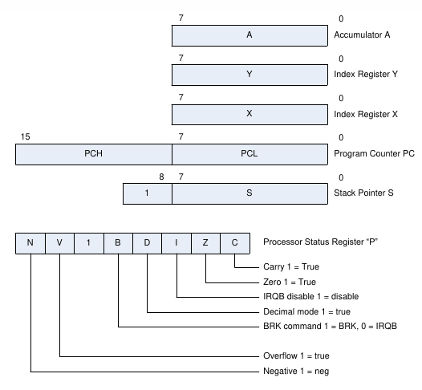
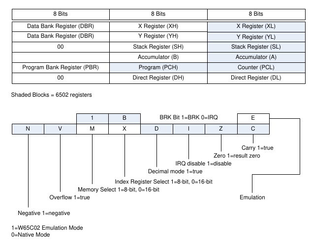
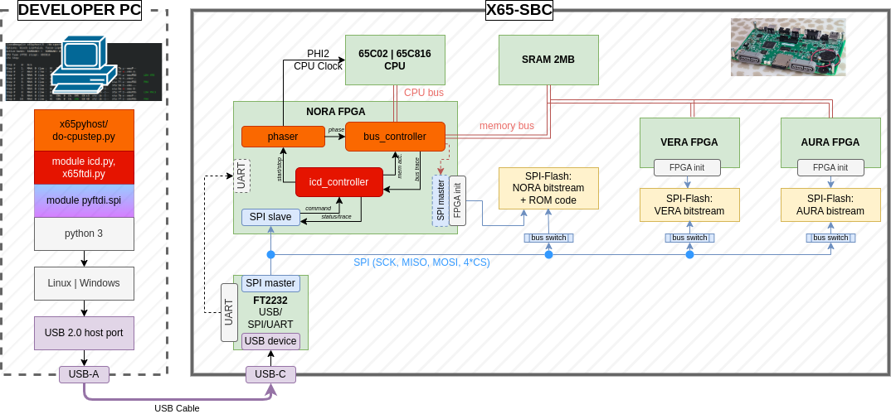
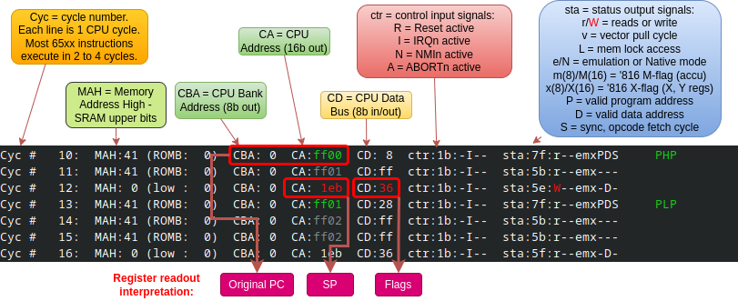
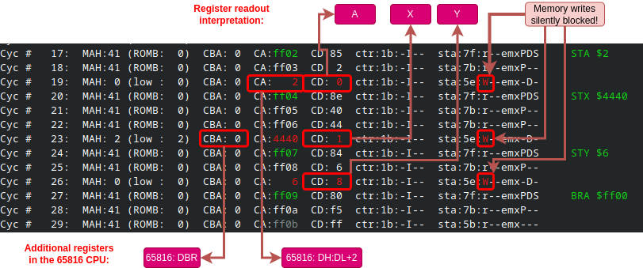
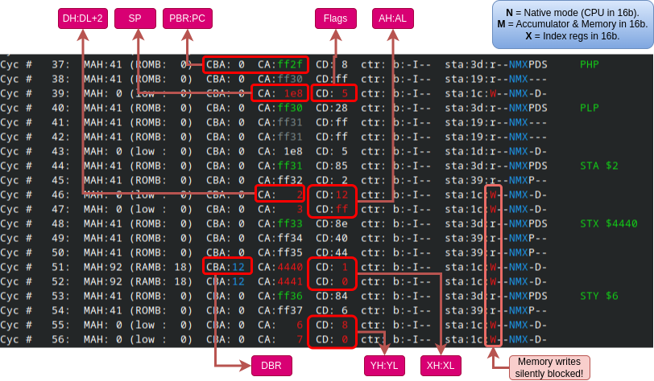
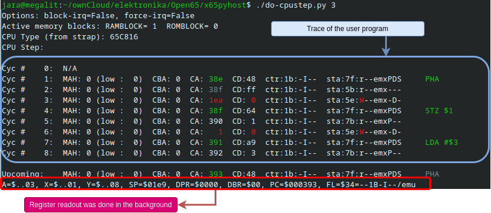

Reading of 6502/65816 CPU Registers by a PC-based Debugger
============================================================

Modern microcontrollers and microprocessors have built-in facilities for external debuggers
to read/write registers, set breakpoints and generally fully control the CPU. 
This is one of the main usecases of the standard [JTAG](https://en.wikipedia.org/wiki/JTAG#Debugging) interface.
The 6502 and 65816 CPUs were created more than a _decade_ before the first version of JTAG was even defined.
They contain no support for external debuggers whatsoever. 

To overcome the lack of debugger support, the system bus controller "NORA" in X65 implements 
the necessary functions for a debugger running on a host PC (with Linux or Windows) and connected over the USB-C port. 
With this support in NORA a debugger can control the 6502/65816 CPU at the instruction level.

One of the basic functions of a debugger is to read out the contents of the programmer visible CPU registers.

For the 8-bit 6502 CPU these are: A, X, Y, S (= SP) (all 8-bit), PC (16-bit), and flags (8-bit); shown below:

For the 16-bit 65816 CPU these are: A, X, Y, S (= SP) (all 16-bit), PC (24-bit), DBR (Data Bank Register, 8-bit), 
Direct Register (DH:DL, 16-bit), and the flags (8-bit); shown below:

Block Diagram of NORA's In-Circuit Debugger (ICD)
--------------------------------------------------

The block diagram below shows the concept of the In-Circuit Debugger (ICD) in the X65 computer.
NORA FPGA implements all interfaces between the 65xx CPU, and the memory bus with SRAM, VERA and AURA FPGAs.
The particular verilog module in NORA that implements the CPU/memory interface is called [bus_controller](../fpga-nora/src/bus_controller.v).
Another module, the [phaser](../fpga-nora/src/phaser.v), generates the CPU clock signal PHI2 
and additional internal timing signals that must be in sync with the CPU execution. 
The third module mentioned in the picture is the [icd_controller](../fpga-nora/src/icd_controller.v)
which controls the bus_controller and phaser during debug sessions, and during system startups,
but othertimes it is idle.

The icd_controller itself responds to commands received from an [SPI Slave](../fpga-nora/src/spi_slave.v)
port, which is connected to physical SPI pins on the FPGA (signals ICD_CSn:in, ICD_MOSI:in, ICD_MISO:out, ICD_SCK:in).
These pins are connected on PCB to the FTDI USB/SPI+UART converter (FT2232H), and from there via a USB cable
to a host PC with a debugger software.

Debugger software for X65 is implemented in Python 3 (with the pyftdi module) and it is available in the
git repository in subfolder x65pyhost.
For simplicity of development, debugger commands are not yet integrated in an IDE but they are available as individual
programs called from a command line.
The most commonly used commands (= python scripts) are listed in the table:

| Command (script)  | Description                   |
| ------------------|-------------------------------|
| do-cpureset.py    | Reset and stop the 65xx CPU   |
| do-cpurun.py      | Run the CPU |
| do-cpustep.py     | Stop the CPU and step it for the given number of instructions or CPU cycles |
| do-dump.py        | Memory dump (including IO areas) |
| do-loadbin.py     | Load a binary from specified host file into X65 memory |
| do-loadprg.py     | Load a C64/CX16 program from a .PRG file into X65 memory |
| do-poke.py        | Write memory location in X65 memory (incl. IO area) |
| do-readregs.py    | Read CPU registers (the CPU must be stopped) |

Register Reading Sequence
--------------------------------------------------

Reading of 65xx CPU internal registers is implemented in the do-readregs.py and do-cpustep.py scripts that communicate
with the ICD module in NORA FPGA over the USB/SPI bridge implemented on the PCB of X65 computer.
Lets discuss how the registers are obtained from the CPU by NORA.
As mentioned previously, the 65xx CPUs have absolutely zero support for external debuggers wishing to access internal registers
outside of a program running in the processor.

The access is gained by forcing a predefined sequence of instructions to the CPU and observing
signals on the CPU Data and Address Buses.
At each CPU cycle, the 65xx processor accesses the external memory for either a read or write.
By observing CPU status signals VPA and VDA (or SYNC), it is possible to determine if any given cycle is an opcode fetch.
If it is an opcode fetch cycle, the debugger can instruct the ICD in NORA to force an *alternative* opcode
to the CPU than what would be read from a memory, thus altering the program flow at will.

The following instruction sequence is forced from the debugger to read out all registers:

    orig_pc:
        PHP             ; we get PC, SP, Flags
        PLP             ; 
        STA $2          ; block writes; We get A, and on 65816 we get B depending on flag M, and we get DH:DL (DPR) on address bus
        STX $4440       ; block writes; We get X, and on 65816 we get XH depending on flag X, we get DBR from CPU Bank Address.
        STY $6          ; block writes; We get Y, and on 65816 we get YH depending on flag X
        BRA orig_pc     ; jump back to the back to leave CPU registers in the original state

The code (PHP-PLP-STA-STX-STY-BRA) is position-independent: it could be execute at any CPU state.
The first two 65xx instructions are *PHP* (Push Flags to Stack) and *PLP* (Pull Flags from Stack).
NORA captures the trace of the the CPU Data Bus, Address Bus and Status signals while these instruction execute
and the debugger uses the trace to reconstruct the original PC (Program Counter) address and 
the SP (Stack Pointer) address, and the flags register.

Screenshot below shows the trace output of *do-cpustep.py* (on Linux PC) when the 65xx CPU (actually 65C816 in Emulation Mode)
is executing the opening PHP-PLP sequence. 
The screenshot is annotated at the top with explanations of trace columns, and at the bottom with the trace fields
that correspond to exposed CPU internal registers:

The original PC (Program Counter) is the op-code fetch address of the first instruction.
The SP (Stack Pointer) is the write address in the third CPU cycle (Cyc #12), and the CPU flags are the data value
written to the memory at that cycle.
The instruction PLP is necessary to restore the contents of SP inside the CPU to the original value.

The next screenshot shows the trace of the remaining instructions in the sequence: STA-STX-STY-BRA.
The contents of registers A, X and Y is obtained from the data bus write cycles during the execution 
of the STA (Store Accumulator), STX (Store X-reg) and STY (Store Y-reg) instructions.
To not disturb the original memory contents by these writes, the memory write signal is silently blocked by NORA, 
although this is not reflected in the trace buffer.

The final instruction BRA (Branch Always) is necessary to restore the original contents of the PC register; 
it instructs the CPU to jump five instruction back.

The 65816 CPU
---------------

So far we discussed how to obtain registers from the 8-bit 6502 processor.
The 16-bit 65816 processor has the common registers extended to 16-bits, plus it has some additional registers.
The traces shown above were obtained on the 65816 CPU running in the 8-bit *Emulation Mode*, where the processor
is behaving like the 8-bit 6502. 
(Emulation Mode is indicated by the "e" in the "sta" field of the trace. 
Mode information is available on an output pin of the processor.)

When the 65816 processor switches to the 16-bit *Native Mode*, the additional registers DBR (Data Bank Register),
PBR (Program Bank Register, part of PC) and DH:DL (Direct (Page) Register) get activated.
The traces above mark where these registers are exposed as well.
Then, depending if the new M and X flags in the CPU Flag Register are cleared, also the Accumulator and Index Registers X/Y are extended to 16-bits.
The M-flag controls the width of the accumulator (A -> AH:AL) and of the memory accesses (in all LD and ST-type instructions), 
and the X-flag control the widths of registers X (XH:XL) and Y (YH:YL).
These three important flags (Emulation or Native mode, M-flag, and X-flag) are available on CPU pins, 
therefore they are always visible in the trace buffer.

The screenshot below shows the trace of the sequence PHP-PLP-STA-STX-STY in case the 65816 CPU is in the 16-bit *Native Mode* 
and also the accumulator and index registers are switched to the 16-bit mode (i.e. M-flag=0, X-flag=0). 
(The BRA instruction is not shown for brevity, but it is also part of the forced sequence.)
We can see that the execution of the STA, STX and STY opcodes gains one additional CPU cycle during which the upper parts
of the A/X/Y registers are written to the memory (these writes are blocked in NORA), and exposed for the debugger.
The contents of the new address registers PBR, DBR, and DH:DL is meanwhile also available on the address bus.

Integration
-------------

The complete register readout sequence is integrated in the script do-cpustep.py.
This script dumps the 65xx CPU trace buffer and then executes a user-specified number of following instructions.
Finally, the script executes the readout sequence in the background and prints the CPU register values.
The forced readout sequence is not shown in the printed trace, of course.

The screenshot below shows the user interface when the command "./do-cpustep.py 3" (step for 3 instruction) 
is started on a Linux host PC connected with a USB cable to the X65 computer.
The last line is the CPU register contents after the last instruction executed (and before "Upcoming", 
which has *not* been executed yet, it is just the prediction of the debugger based on PC).
Notice how the displayed contents of the A register ($03) in the last line corresponds to the LDA instruction (LDA #$03),
and the contents of the SP register ($1e9) corresponds to the push-address in the first PHA instruction 
($1ea = the SP is decremented AFTER pushing).

Conclusion
------------

In embedded systems reading of processor registers via a JTAG connection from a host PC is the basic functionality
that we take for granted.
Using the "NORA" FPGA as the system controller in the X65 computer brings this functionality also to the world
of 6502/65816 processors.
