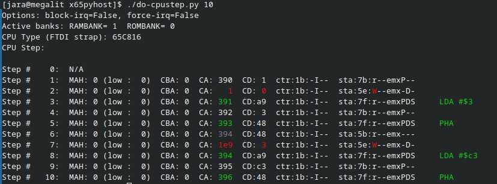
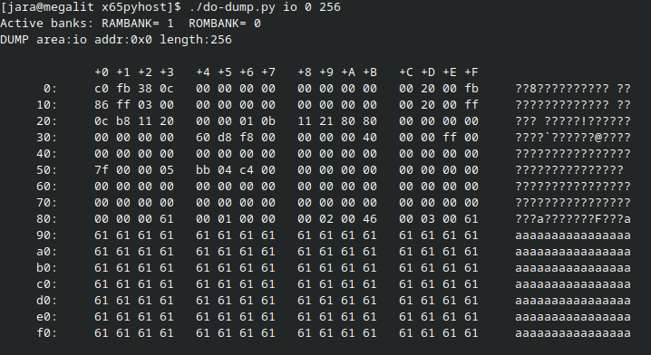

In-Circuit Debugger (ICD)
===========================

**In-circuit debugger** (ICD) integrated with NORA and accessible over the device USB-C port from a host PC
running Linux or Windows. 
The ICD can write all permanent (SPI-Flash) memories in the system, even in a totally empty / bricked state. 
PC host software is written in Python and should be portable to other fruitful systems besides Linux and Windows.

Together with NORA the ICD supports JTAG-like functions like memory poke/dump, CPU stop/step, instruction
trace buffer, interrupt forcing/blocking etc.

Example: Live trace/step of the CPU:

Example: Dump of the IO area ($9F00 to $9FFF):

