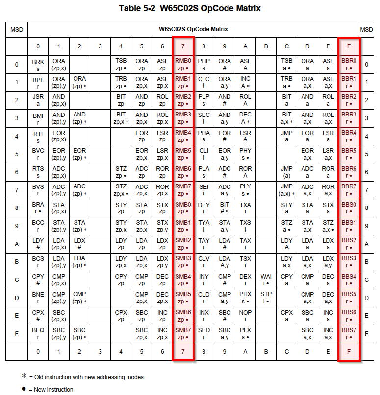
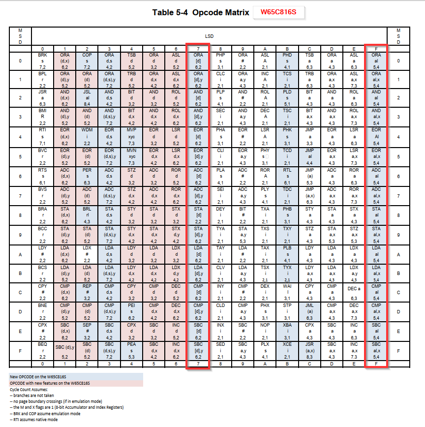

ISAFIX-816
==============

Regarding the Instruction Set Architecture (ISA), 32 instructions are different between the 6502 and 65816 processors.
The following two tables, copied from datasheets of the processors, highlight them.
They are in the column 7 and F, i.e. the problematic instructions have the op-code x7 and xF, where x is 0..F.

The problematic instructions (from the 65C816 point of view) are the following 65C02 instructions:
* RMB0..RMB7 zp = Reset Memory Bit in zero-page
* SMB0..SMB7 zp = Set Memory Bit in zero-page
* BBR0..BBR7 zp, rr = Branch on Bit Set in zero-page to relative address
* BBS0..BBS7 zp, rr = Branch on Bit Reset in zero-page to relative address

If 65C816 (in the Emulation Mode) should run a program originally written for 65C02, these instructions must be replaced
with an alternative code. 

Replace:

    RMBn/SMBn   zp              ; ?7 zp

With:

    NOP                         ; EA; skip over bad instruction
    NOP                         ; EA; skip over its operand; catch zp from memory

and make changes to "(zp)" in NORA behind the scene.

Replace:

    BBRn/BBSn   zp, rr               ; ?F zp rr

With:

    NOP                         ; EA; skip over bad instruction
    BRA                         ; 80; catch zp from memory
                                ; NORA checks if interested bit is 0/1 in the zp, if the branch would be taken/not-taken.

If 6502 would not-take the branch, then we just need to skip the rr byte and we will be on correct path.
Therefore, force:

    00                         ; BRA continues to next instruction

On the other hand, if 6502 *would* take the branch, then force instruction

    .                           ; let BRA pick up the correct rr from next byte and continue.

ALTERNATIVE APPROACH: MAX IN SW
---------------------------------

Detect wrong instruction during S5H.
Generate RDY=LOW (maybe delay S5H by 1cc to ensure good RDY setup).
Then PHY2 falling edge.
Do RDY=HIGH and ABORT=LOW => the CPU should abort the bad instruction and go to the abort handler.
Rest in SW (maybe with HW accel if necessary).

IMPROVEMENT:
All the wrong instructions are multi-byte.
We could do ABORT on the second instruction byte and the result is the same!

Step #   -2:  MAH:40 (ROMB:  0)  CBA: 0  CA:ff1a  CD: 0  ctr:13:RI--  sta:5b:r--emx---     
Step #   -1:  MAH:40 (ROMB:  0)  CBA: 0  CA:ff1a  CD: 0  ctr:13:RI--  sta:5b:r--emx---     
Step #    0:  MAH:40 (ROMB:  0)  CBA: 0  CA:ff1a  CD: 0  ctr:13:RI--  sta:5b:r--emx---     
Step #    1:  MAH:40 (ROMB:  0)  CBA: 0  CA:ff1a  CD: 0  ctr:1b:-I--  sta:5b:r--emx---     
Step #    2:  MAH:40 (ROMB:  0)  CBA: 0  CA:ff1a  CD: 0  ctr:1b:-I--  sta:5b:r--emx---     
Step #    3:  MAH:41 (ROMB:  0)  CBA: 0  CA:ffff  CD:ff  ctr:1b:-I--  sta:7f:r--emxPDS     SBC $434241,X    ; WARNING: 6502-only opcode while in the EMU mode!
Step #    4:  MAH:42 (ROMB:  1)  CBA: 0  CA:ff1a  CD:58  ctr:1b:-I--  sta:5b:r--emx---     
Step #    5:  MAH: 0 (low :  0)  CBA: 0  CA: 1ff  CD: 3  ctr:1b:-I--  sta:5f:r--emx-D-     
Step #    6:  MAH: 0 (low :  0)  CBA: 0  CA: 1fe  CD:14  ctr:1b:-I--  sta:5f:r--emx-D-     
Step #    7:  MAH: 0 (low :  0)  CBA: 0  CA: 1fd  CD:24  ctr:1b:-I--  sta:5f:r--emx-D-     
Step #    8:  MAH:41 (ROMB:  0)  CBA: 0  CA:fffc  CD: 0  ctr:1b:-I--  sta:57:rv-emx-D-     
Step #    9:  MAH:41 (ROMB:  0)  CBA: 0  CA:fffd  CD:ff  ctr:1b:-I--  sta:57:rv-emx-D-     
Step #   10:  MAH:41 (ROMB:  0)  CBA: 0  CA:ff00  CD:a2  ctr:1b:-I--  sta:7f:r--emxPDS     LDX #$ff
Step #    1:  MAH:41 (ROMB:  0)  CBA: 0  CA:ff01  CD:ff  ctr:1b:-I--  sta:7b:r--emxP--     
Step #    2:  MAH:41 (ROMB:  0)  CBA: 0  CA:ff02  CD:9a  ctr:1b:-I--  sta:7f:r--emxPDS     TXS
Step #    3:  MAH:41 (ROMB:  0)  CBA: 0  CA:ff03  CD:9a  ctr:1b:-I--  sta:5b:r--emx---     
Step #    4:  MAH:41 (ROMB:  0)  CBA: 0  CA:ff03  CD:a9  ctr:1b:-I--  sta:7f:r--emxPDS     LDA #$2
Step #    5:  MAH:41 (ROMB:  0)  CBA: 0  CA:ff04  CD: 2  ctr:1b:-I--  sta:7b:r--emxP--     
Step #    6:  MAH:41 (ROMB:  0)  CBA: 0  CA:ff05  CD:8d  ctr:1b:-I--  sta:7f:r--emxPDS     STA $9f02
Step #    7:  MAH:41 (ROMB:  0)  CBA: 0  CA:ff06  CD: 2  ctr:1b:-I--  sta:7b:r--emxP--     
Step #    8:  MAH:41 (ROMB:  0)  CBA: 0  CA:ff07  CD:9f  ctr:1b:-I--  sta:7b:r--emxP--     
Step #    9:  MAH:41 (ROMB:  0)  CBA: 0  CA:9f02  CD: 2  ctr:1b:-I--  sta:5e:W--emx-D-     
Step #   10:  MAH:41 (ROMB:  0)  CBA: 0  CA:ff08  CD:a9  ctr:1b:-I--  sta:7f:r--emxPDS     LDA #$1
Step #    1:  MAH:41 (ROMB:  0)  CBA: 0  CA:ff09  CD: 1  ctr:1b:-I--  sta:7b:r--emxP--     
Step #    2:  MAH:41 (ROMB:  0)  CBA: 0  CA:ff0a  CD:48  ctr:1b:-I--  sta:7f:r--emxPDS     PHA
Step #    3:  MAH:41 (ROMB:  0)  CBA: 0  CA:ff0b  CD:48  ctr:1b:-I--  sta:5b:r--emx---     
Step #    4:  MAH: 0 (low :  0)  CBA: 0  CA: 1ff  CD: 1  ctr:1b:-I--  sta:5e:W--emx-D-     
Step #    5:  MAH:41 (ROMB:  0)  CBA: 0  CA:ff0b  CD:29  ctr:1b:-I--  sta:7f:r--emxPDS     AND #$2
Step #    6:  MAH:41 (ROMB:  0)  CBA: 0  CA:ff0c  CD: 2  ctr:1b:-I--  sta:7b:r--emxP--     
Step #    7:  MAH:41 (ROMB:  0)  CBA: 0  CA:ff0d  CD:8d  ctr:1b:-I--  sta:7f:r--emxPDS     STA $9f00
Step #    8:  MAH:41 (ROMB:  0)  CBA: 0  CA:ff0e  CD: 0  ctr:1b:-I--  sta:7b:r--emxP--     
Step #    9:  MAH:41 (ROMB:  0)  CBA: 0  CA:ff0f  CD:9f  ctr:1b:-I--  sta:7b:r--emxP--     
Step #   10:  MAH:41 (ROMB:  0)  CBA: 0  CA:9f00  CD: 0  ctr:1b:-I--  sta:5e:W--emx-D-     
Step #    1:  MAH:41 (ROMB:  0)  CBA: 0  CA:ff10  CD:a9  ctr:1b:-I--  sta:7f:r--emxPDS     LDA #$2
Step #    2:  MAH:41 (ROMB:  0)  CBA: 0  CA:ff11  CD: 2  ctr:1b:-I--  sta:7b:r--emxP--     
Step #    3:  MAH:41 (ROMB:  0)  CBA: 0  CA:ff12  CD:68  ctr:1b:-I--  sta:7f:r--emxPDS     PLA
Step #    4:  MAH:41 (ROMB:  0)  CBA: 0  CA:ff13  CD:68  ctr:1b:-I--  sta:5b:r--emx---     
Step #    5:  MAH:41 (ROMB:  0)  CBA: 0  CA:ff13  CD:68  ctr:1b:-I--  sta:5b:r--emx---     
Step #    6:  MAH: 0 (low :  0)  CBA: 0  CA: 1ff  CD: 1  ctr:1b:-I--  sta:5f:r--emx-D-     
Step #    7:  MAH:41 (ROMB:  0)  CBA: 0  CA:ff13  CD:1a  ctr:1b:-I--  sta:7f:r--emxPDS     INC A
Step #    8:  MAH:41 (ROMB:  0)  CBA: 0  CA:ff14  CD:1a  ctr:1b:-I--  sta:5b:r--emx---     
Step #    9:  MAH:41 (ROMB:  0)  CBA: 0  CA:ff14  CD: 7  ctr:1b:-I--  sta:7f:r--emxPDS     ORA [$3]    ; WARNING: 6502-only opcode while in the EMU mode!
Step #   10:  MAH:41 (ROMB:  0)  CBA: 0  CA:ff15  CD: 3  ctr:1a:-I-A  sta:7b:r--emxP--     
Step #   11:  MAH: 0 (low :  0)  CBA: 0  CA:   3  CD: 0  ctr:1b:-I--  sta:5f:r--emx-D-     
Step #   12:  MAH: 0 (low :  0)  CBA: 0  CA:   4  CD: 0  ctr:1b:-I--  sta:5f:r--emx-D-     
Step #   13:  MAH: 0 (low :  0)  CBA: 0  CA:   5  CD: 0  ctr:1b:-I--  sta:5f:r--emx-D-     
Step #   14:  MAH: 0 (low :  0)  CBA: 0  CA:   0  CD: 7  ctr:1b:-I--  sta:5f:r--emx-D-     
Step #   15:  MAH:41 (ROMB:  0)  CBA: 0  CA:ff16  CD:87  ctr:1b:-I--  sta:7f:r--emxPDS     STA [$3]    ; WARNING: 6502-only opcode while in the EMU mode!
Step #   16:  MAH:41 (ROMB:  0)  CBA: 0  CA:ff16  CD:f0  ctr:1b:-I--  sta:5b:r--emx---     
Step #   17:  MAH: 0 (low :  0)  CBA: 0  CA: 1ff  CD:ff  ctr:1b:-I--  sta:5e:W--emx-D-     
Step #   18:  MAH: 0 (low :  0)  CBA: 0  CA: 1fe  CD:14  ctr:1b:-I--  sta:5e:W--emx-D-     
Step #   19:  MAH: 0 (low :  0)  CBA: 0  CA: 1fd  CD:24  ctr:1b:-I--  sta:5e:W--emx-D-     
Step #   20:  MAH:41 (ROMB:  0)  CBA: 0  CA:fff8  CD:1a  ctr:1b:-I--  sta:57:rv-emx-D-     
Step #    1:  MAH:41 (ROMB:  0)  CBA: 0  CA:fff9  CD:ff  ctr:1b:-I--  sta:57:rv-emx-D-     
Step #    2:  MAH:41 (ROMB:  0)  CBA: 0  CA:ff1a  CD:48  ctr:1b:-I--  sta:7f:r--emxPDS     PHA
Step #    3:  MAH:41 (ROMB:  0)  CBA: 0  CA:ff1b  CD:48  ctr:1b:-I--  sta:5b:r--emx---     
Step #    4:  MAH: 0 (low :  0)  CBA: 0  CA: 1fc  CD: 2  ctr:1b:-I--  sta:5e:W--emx-D-     
Step #    5:  MAH:41 (ROMB:  0)  CBA: 0  CA:ff1b  CD:68  ctr:1b:-I--  sta:7f:r--emxPDS     PLA
Step #    6:  MAH:41 (ROMB:  0)  CBA: 0  CA:ff1c  CD:68  ctr:1b:-I--  sta:5b:r--emx---     
Step #    7:  MAH:41 (ROMB:  0)  CBA: 0  CA:ff1c  CD:68  ctr:1b:-I--  sta:5b:r--emx---     
Step #    8:  MAH: 0 (low :  0)  CBA: 0  CA: 1fc  CD: 2  ctr:1b:-I--  sta:5f:r--emx-D-     
Step #    9:  MAH:41 (ROMB:  0)  CBA: 0  CA:ff1c  CD:40  ctr:1b:-I--  sta:7f:r--emxPDS     RTI
Step #   10:  MAH:41 (ROMB:  0)  CBA: 0  CA:ff1d  CD:40  ctr:1b:-I--  sta:5b:r--emx---     
Step #   11:  MAH:41 (ROMB:  0)  CBA: 0  CA:ff1d  CD:40  ctr:1b:-I--  sta:5b:r--emx---     
Step #   12:  MAH: 0 (low :  0)  CBA: 0  CA: 1fd  CD:24  ctr:1b:-I--  sta:5f:r--emx-D-     
Step #   13:  MAH: 0 (low :  0)  CBA: 0  CA: 1fe  CD:14  ctr:1b:-I--  sta:5f:r--emx-D-     
Step #   14:  MAH: 0 (low :  0)  CBA: 0  CA: 1ff  CD:ff  ctr:1b:-I--  sta:5f:r--emx-D-     
Step #   15:  MAH:41 (ROMB:  0)  CBA: 0  CA:ff14  CD: 7  ctr:1b:-I--  sta:7f:r--emxPDS     ORA [$3]    ; WARNING: 6502-only opcode while in the EMU mode!
Step #   16:  MAH:41 (ROMB:  0)  CBA: 0  CA:ff15  CD: 3  ctr:1b:-I--  sta:7b:r--emxP--     
Step #   17:  MAH: 0 (low :  0)  CBA: 0  CA:   3  CD: 0  ctr:1b:-I--  sta:5f:r--emx-D-     
Step #   18:  MAH: 0 (low :  0)  CBA: 0  CA:   4  CD: 0  ctr:1b:-I--  sta:5f:r--emx-D-     
Step #   19:  MAH: 0 (low :  0)  CBA: 0  CA:   5  CD: 0  ctr:1b:-I--  sta:5f:r--emx-D-     
Step #   20:  MAH: 0 (low :  0)  CBA: 0  CA:   0  CD: 7  ctr:1b:-I--  sta:5f:r--emx-D-     

We need extra support to place the ABORT handler in special ROMBLOCK, switch to it / remember the old one in a shadow reg.
In the handler, disable all IRQs/NMIs, switch to Native mode and jump to secondary handler (in CBA != 0).
In the secondary handler, restore the original ROMBLOCK - so that the CBA=0 space is as-original.
Now inspect the faulting instruction and emulate it (maybe with co-proc. help).
Finally, get back to the special ROMBLOCK, switch to emulation mode and RTI; original ROMBLOCK must be restored by hw during the RTI!!
Is this easier if we can put part of the code to unpaged memory in CBA=0 ?
