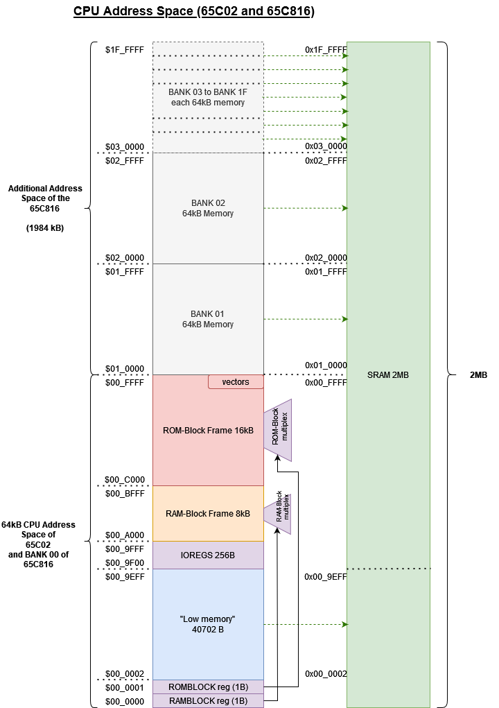
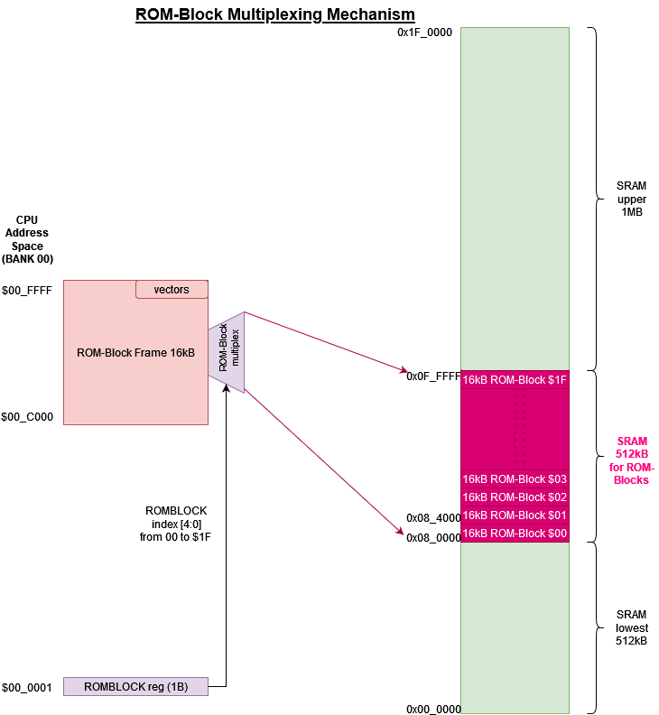

Memory Map
===========

This document describes the memory map of the X65 computer.

Introduction
-------------

To follow the 6502 aesthetics, we write here addresses in hexadecimal numbers with the leading character '$'.
For example, $1234 is the hexadecimal address 0x1234. If the underscore '_' character is used, it hase no functional meaning 
and serves just to visually divide long hex string into human-readable chunks. For example, $123456 could be written also $12_3456.

The X65 computer supports two slightly different processors: 65C02 and 65C816. Default is 65C816.
Following the CPU type, the CPU address space is either 64kB (16-bit) long in case of 65C02 CPU, 
or 16MB (24-bit) long in case of 65C816 CPU.

The 16-bit addresses are specified with four hex-digits, and the 24-bit addresses with 6 hex digits.
When we specify a 16-bit address, e.g. $1234, in the context of the 65C816 this gets extended on the left by 00, 
i.e. it is just identical to $001234 (= $00_1234).

Memory Quantities
------------------

The official 65C02 and 65C816 documentation defines the following multi-byte quantities:

* **PAGE** = 256 Bytes (typically alligned).
* **BANK** = 64 kB (alligned).

The 8-bit 65C02 processor has the special **PAGE ZERO** from $0000 to $00FF and **PAGE ONE** from $0100 to $01FF, for stack. 
It has exactly one 64kB **BANK** from $0000 to $FFFF, which is its entire address space.

The 16-bit 65C816 processor is more complex. It has a **DIRECT PAGE**, which by default is the same as the ZERO PAGE in 65C02, 
but software can relocate it anywhere in the first **BANK** (64kB) of the address space (even to an unaligned address).

Then the 16-bit processor has 256 BANKs of 64kB each. The BANK address is simply the highest-order 8 bits of the 24-bit address.
The lower 16 address bits specify offset within a BANK, which can be up to 64kB.
Since 256 * 64kB = 16MB, this defines the entire CPU 65C816 address space.

Relation to Commander X16 "banks"
---------------------------------

Quite unfortunately, in the Commander X16 (CX16) parlance, the english word "bank" is used in the RAMBANK and ROMBANK mechanism 
that provides 8kB and 16kB-based multiplexing of "high memory" (above 64kB boundary) into the base 64k memory of 65C02. 
This use of the word "bank" clashes with the official BANK (64kB quntity) from the 65C816 CPU documentation.

In X65 computer the identical memory multiplexing mechanism is called RAMBLOCK and ROMBLOCK, 
to distinguish it from the BANK registers of the 65C816 processor.
Functionally our RAMBLOCK and ROMBLOCK registers are compatible with CX16's RAMBANK and ROMBANK.

CPU Address Space View
------------------------

The picture below shows the CPU address map view.
The entire physical space is 2MB and it is mostly direct-mapped to the 2MB SRAM.
The bottom 64kB (BANK 00) of CPU has a special layout comprising of IOREGS, RAM-Block frame and ROM-Block frame.

SRAM 2MB
---------

The SRAM is 2MB or 2048kB long (physical address is 21-bits wide).
Since X65 has no traditional parallel ROM devices, all "ROM" code is just loaded in RAM and made accessible as such.
(In case of legacy CX16 runtime mode, the CX16 system 'sees' just 1MB of RAM through the RAM-Block mechanism
because the other 1MB is used to store the ROM blocks and the low memory.)

In case of the 16-bit processor 65C816 the 2MB SRAM is directly accessible starting from the bottom of the CPU address space at the address $00_0000.
The 2048kB of SRAM is (2048/64) = 32 BANKs, therefore the (64kB) BANKs 0 to 31 directly map to the SRAM.
In other words the 65C816 CPU sees the RAM from $00_0000 to $1F_FFFF. Banks 32-255 are not defined.
The first bank, BANK 0, has a special mapping as shown above.

In case of the 8-bit processor 65C02, which can directly address just the BANK 0 (64kB), the first cca 40kB of the SRAM are mapped to the CPU address space ($0000 to $9EFF).
The other cca 24kB of the 65C02 address space is used by I/O space and by the RAM and ROM BLOCK frame - see below.
With the RAM and ROM BLOCK mechanism the 65C02 can indirectly access the whole 2MB of the SRAM, but at the cost of added SW complexity.

RAM/ROM-Block multiplexing registers - RAMBLOCK and ROMBLOCK
---------------------------------------------------------------------

To gain access to the whole 2MB of SRAM from 65C02, which is limited to BANK 0 (64kB), the system employs 
a memory multiplexing mechanism called RAMBLOCK and ROMBLOCK.
(Note: the mechanism described here works exactly the same in the 65C816 processor as well.)
The 8kB area of CPU address space from $A000 to $BFFF (in CPU BANK 0) is called a RAMBLOCK Frame.
And the 16kB area of CPU address space from $C000 to $FFFF (in CPU BANK 0) is called a ROMBLOCK Frame.
For these Frames there are two corresponding 8-bit register called RAMBLOCK and ROMBLOCK that multiplex SRAM blocks in the frames.
The register RAMBLOCK is at the address $0000 (in BANK 0) and ROMBLOCK is at the address $0001 (in BANK 0).
The registers are described in detail in [I/O Registers](ioregs.md).

__Mapping of RAMBLOCKs to SRAM__

The 2MB SRAM has exactly (2048kB / 8kB) = 256 of 8kB RAM-Blocks. With the RAMBLOCK-Frame multiplexing any byte of the SRAM is potentially reachable through the frame.
Mapping of a RAM-Block number 0 - 255 to SRAM is straight-forward albeit with a small detail: 
the top bit (bit 7) of RAMBLOCK register is inverted and then the result is taken as SRAM memory address bits 21:14. 
Therefore, RAMBLOCKs 0 to 127 are mapped to the SRAM area between 1MB and 2MB (from $10_0000 to $1F_0000),
and RAMBLOCKs 128 to 256 are mapped to SRAM area between 0 and 1MB (from $00_0000 to $0F_FFFF).
The reason for this twisted mapping is software compatibility. 
Legacy SW, such as CX16 ROMs, will use RAMBLOCKs starting from 0 up to some number, and we don't want
to have these mapped at the beginning of SRAM where the important low-memory (BANK 0) is located.

__Mapping of ROMBLOCKs to SRAM__

There are 32 ROM-Blocks, each 16kB, for a combined capacity (32 * 16kB) = 512kB.
ROM-Blocks are mapped in the SRAM in the area between 512kB and 1MB.
ROM-Block 0 maps to SRAM address from $08_0000 to $08_3FFF, followed by ROM-Block 1 from $08_4000 to $08_7FFF, and so on.
Tha last ROM-Block 31 is in SRAM address from $0F_C000 to $0F_FFFF, which is the middle of SRAM.

Note that the SRAM area from $08_0000 to $0F_FFFF used by ROM-Blocks is also accessible via the RAM-Block mechanism.
ROM-Block 0 is the same as RAM-Block 192 and 193 (remember ROM-Blocks are 16kB but RAM-Blocks 8kB, so we need two),
ROM-Block 1 is at RAM-Block 194 and 195, and so on, until ROM-Block 31 is at RAM-Block 254 and 255.

I/O device space: 256 Bytes from $9F00 to $9FFF
------------------------------------------------

The 256 Byte long I/O device space is mapped in CPU address space from $9F00 to $9FFF in CPU BANK 0.
Find more details in [ioregs.md](ioregs.md).

PBL (Primary Bootloader) ROM: 512 Bytes
------------------------------------------

PBL ROM gets activated when register ROMBLOCK bit 7 is 1.
Then it is dislayed in the ROM-Block Frame starting at $00_C000. 
The 512B PBL ROM is mirrored over the entire 16kB ROM-Block frame.

